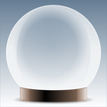

# Published Apps

Nothing to see here. Yet.

# Beta Apps

Nothing to see here either. Yet.

# Coursework

[**Todoey App (Enhanced UI/UX)**](https://github.com/howswift/complete-ios-bootcamp/pull/28)
[**Todoey App (Realm.io)**](https://github.com/howswift/complete-ios-bootcamp/pull/27)
[**Todoey App (CoreData)**](https://github.com/howswift/complete-ios-bootcamp/pull/26)

[**Flash Chat**](https://github.com/howswift/complete-ios-bootcamp/pull/25)
A simplified WhatsApp clone that uses Firebase as the backend.

[**Bitcoin Ticker**](https://github.com/howswift/complete-ios-bootcamp/pull/24)
A current Bitcoin price app, based on the currency selected.

[**Clima**](https://github.com/howswift/complete-ios-bootcamp/pull/23)
A location-based weather app.

[**Destini**](https://github.com/howswift/complete-ios-bootcamp/pull/19)
A short 'Choose Your Own Adventure' game similar to Lifeline.

[**Quizzler**](https://github.com/howswift/complete-ios-bootcamp/pull/11)
A true/false quiz game that introduced the MVC design pattern.

[**Xylophone**](https://github.com/howswift/complete-ios-bootcamp/pull/5)
An app that triggers sounds with xylophone keys on the screen.

[**Magic 8-Ball**](https://github.com/howswift/complete-ios-bootcamp/pull/2)
A simple app that recreates the novelty magic 8-ball.
